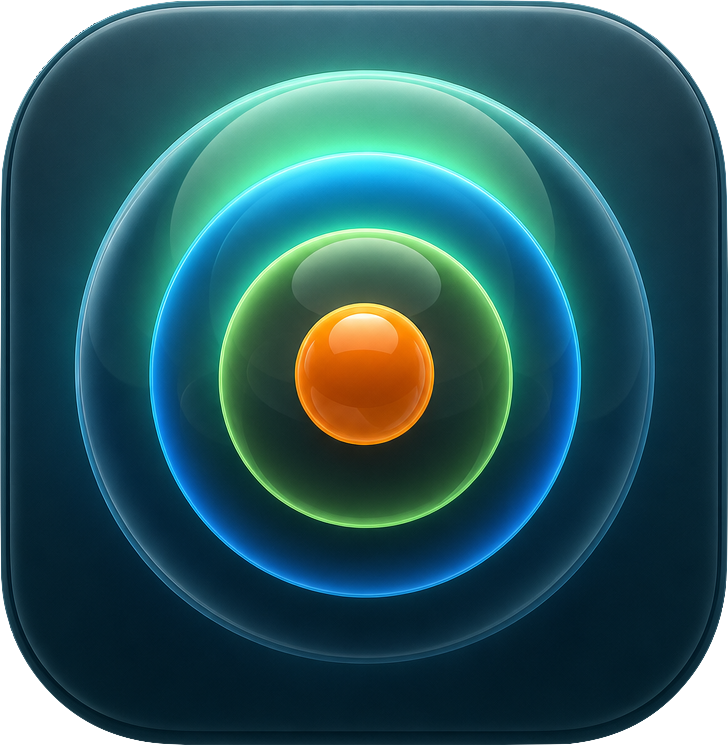
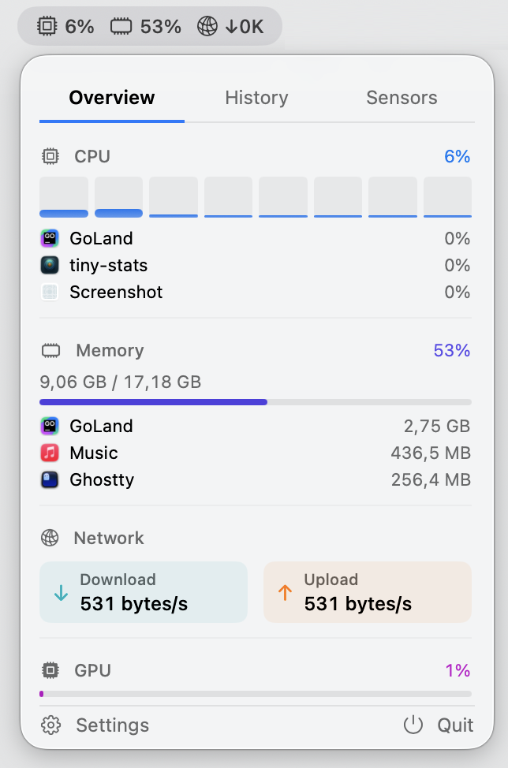
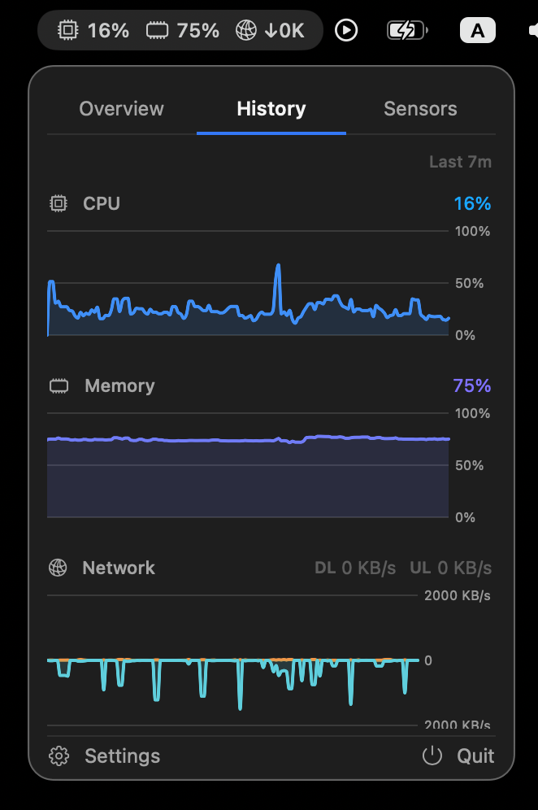
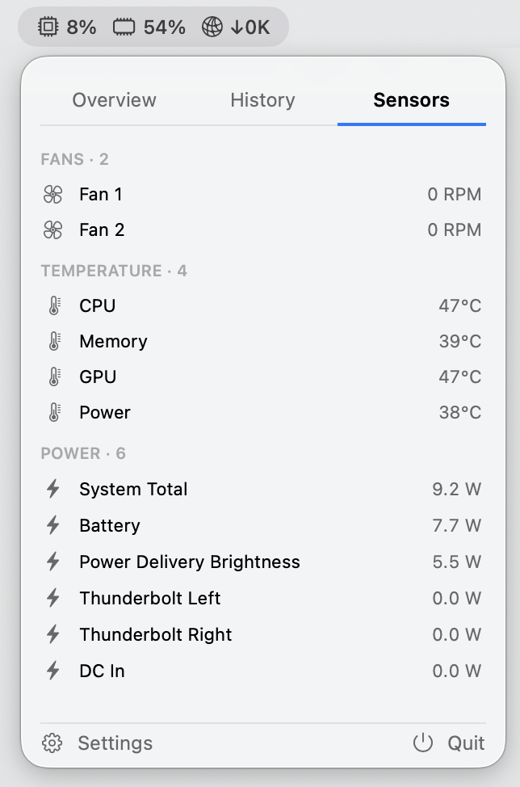
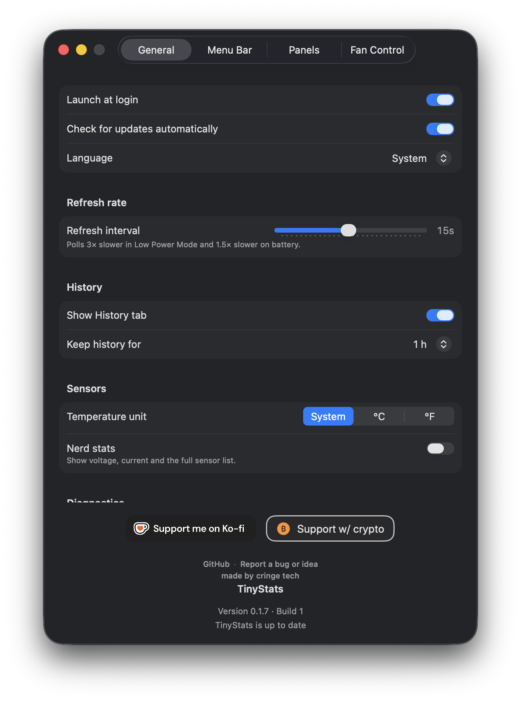
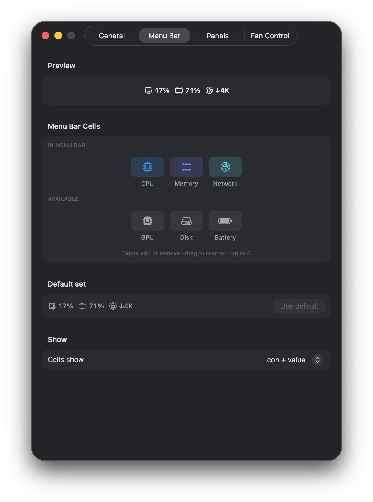
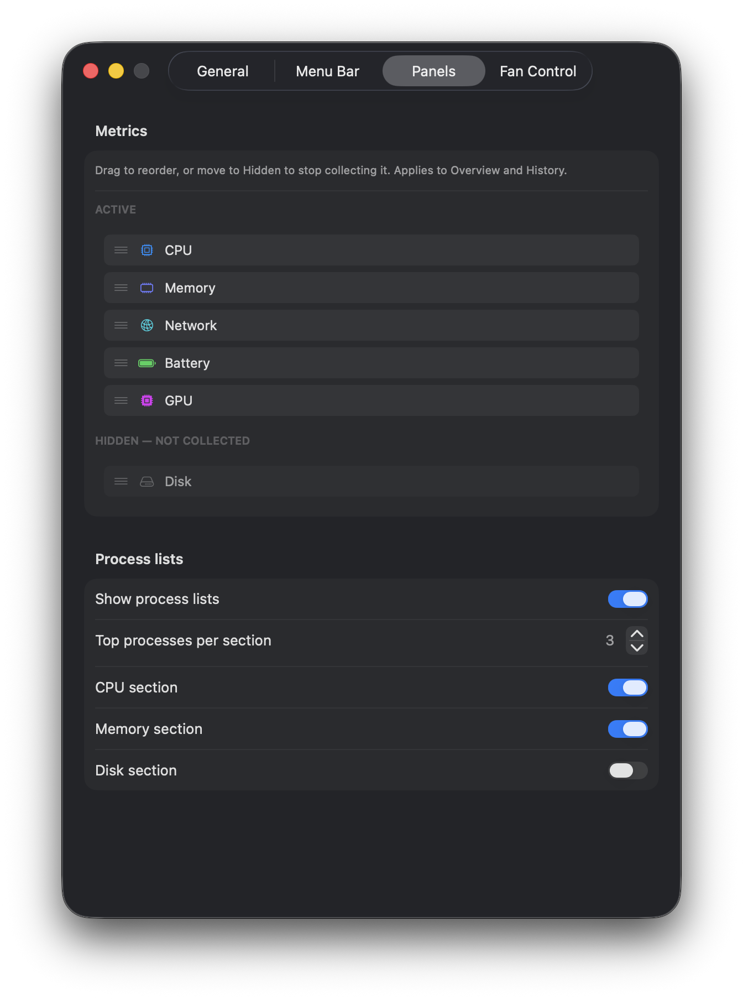
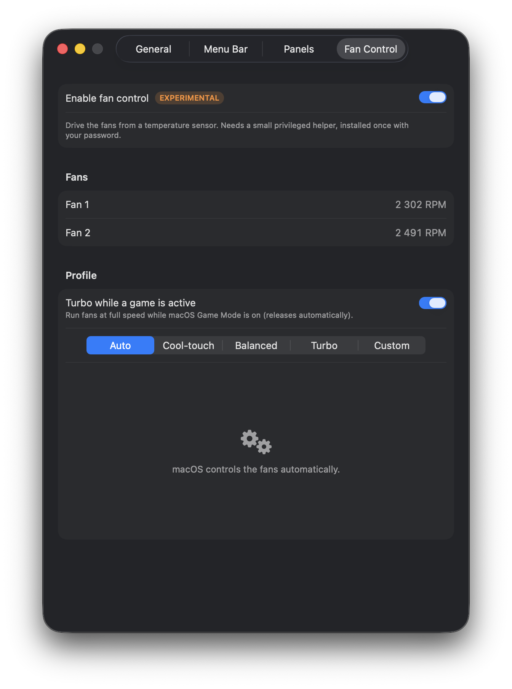

<p align="center">
  
</p>

<h1 align="center">TinyStats</h1>

A tiny, native macOS menu bar system monitor. Minimal, HIG-friendly, and built to be
light on CPU and battery. Open source (MIT).

## Features

- **Menu bar cells** — show up to 5 metrics inline (CPU, GPU, memory, network, disk, battery).
  A Mail-style **"drag into the toolbar" customizer** lets you tap or drag tiles to add,
  remove and reorder them, with a default set one click away. Choose what each cell shows:
  **icon + value**, **label + value**, or **value only**.
- **Dropdown with up to 3 tabs** (click the menu bar icon):
  - **Overview** — one section per resource with a usage bar, plus the **top N processes**
    (configurable, with app icons and names) for CPU, memory and disk. The CPU section also
    shows **per-core load**.
  - **History** — recent area/line charts (Swift Charts). Network and disk are drawn
    bidirectionally (download/read up, upload/write down). Retention is configurable
    (1, 5, 15, 30 min or 1 h). The whole tab can be hidden.
  - **Sensors** — live SMC readings with **human-readable names** (per Apple-Silicon
    generation and Intel). The plain view shows component averages (CPU / Memory / GPU /
    Power); **Nerd stats** reveals every named sensor (per-core, per-cluster, banks),
    fans, power, plus voltage and current. Temperature unit follows the system or can be
    pinned to °C / °F.
- **Fan control** — set fan speed manually or via a temperature curve. Choose a preset
  (Cool-touch / Balanced / Turbo / Auto) or draw your own curve against CPU, GPU or
  Power+Battery temperature. Includes a **Turbo-while-gaming** mode that follows the native
  macOS Game Mode signal. Runs through a lightweight privileged helper daemon (installed
  once with an admin password prompt); the helper enforces minimum RPM, hard-cuts back to
  Auto on disconnect or crash, and reverts on exit — so a stuck speed cannot survive an app
  quit or a daemon kill.
- **Hide what you don't use** — drag any metric to *Hidden* and tiny-stats **stops
  collecting data for it entirely**, not just hiding the UI.
- **Live settings** — changes apply immediately (no Save step), with a live menu-bar
  preview. Organised into **General**, **Menu Bar**, **Panels** and **Fan Control** tabs.
- **Keyboard shortcuts** — `⌘1`–`⌘3` switch tabs, `⌘,` opens settings, `⌘Q` quits.
- **Battery-friendly** — a single shared polling loop with an adaptive interval that slows
  3× in Low Power Mode and 1.5× on battery, reads SMC sensors only when the Sensors tab is
  open, samples processes only for the Overview, and skips collectors for hidden metrics.

## Screenshots

### Panels

<table>
  <tr>
    <td></td>
    <td></td>
    <td></td>
  </tr>
</table>

### Settings

<table>
  <tr>
    <td></td>
    <td></td>
    <td></td>
    <td></td>
  </tr>
</table>

## Requirements

- macOS 14 or newer (Apple Silicon or Intel).
- To build: a Swift 6 toolchain. **Xcode is not required** — the Command Line Tools are
  enough.

## Install

Download **[TinyStats.dmg](https://github.com/cringe-tech/tiny-stats/releases/latest/download/TinyStats.dmg)**
and drag it to Applications. Or with Homebrew, from our tap
[`cringe-tech/homebrew-apps`](https://github.com/cringe-tech/homebrew-apps):

```sh
brew tap cringe-tech/apps
brew install --cask tinystats
```

(`brew install --cask cringe-tech/apps/tinystats` taps and installs in one step.)

The build is ad-hoc signed (not yet notarized): on a plain double-click Gatekeeper will warn —
right-click → **Open**, or System Settings → Privacy & Security → **Open Anyway**. Homebrew
handles this for you. See [RELEASING.md](RELEASING.md) for how releases are cut.

## Build & run

```sh
# Run straight from SwiftPM (debug):
swift run TinyStats

# Or build a proper TinyStats.app bundle (release, ad-hoc signed):
Scripts/bundle.sh
open TinyStats.app
```

The app is a menu bar agent (`LSUIElement`) — it has no Dock icon. Quit it from the
popover's **Quit** button or `⌘Q`.

## Tests

The math-heavy and table-driven parts run as an offline self-test without Xcode/XCTest:

```sh
swift run TinyStatsSelfTest          # offline unit checks (CPU/network math, sensor tables, fan curves)
swift run TinyStatsSelfTest --live   # sample the real engine once (incl. SMC sensors)
swift run TinyStatsSelfTest --smc    # dump raw SMC keys for debugging
```

## How it reads (and writes) sensors

System metrics use native Apple APIs (`host_statistics64`, `getifaddrs`, IOKit registry
for GPU/disk/battery). Hardware sensors come from the **SMC** via a small C bridge
([`Sources/CSMC`](Sources/CSMC)). In monitoring-only mode the bridge is read-only; when
**Fan Control** is enabled a privileged helper daemon (`TinyStatsFanHelper`) uses the same
bridge to write fan-target keys (`F{i}Md` / `F{i}Tg`). Keys are enumerated by prefix into
temperature / fan / voltage / current / power and shown by their raw SMC key in *Nerd stats*;
sensor classification needs no per-model table, so it keeps working on chips that ship after
this build.

## Project layout

```
Sources/
  CSMC/                 C bridge to the AppleSMC IOKit service (read + write)
  SMCKit/               SMC connection, sensor discovery, naming tables, classifier
  CGameMode/            C shim exposing <notify.h> to Swift (macOS Game Mode detection)
  FanControlShared/     XPC protocol shared by the app and the fan helper
  TinyStatsCore/        collectors, polling engine, fan controller, fan models
  TinyStats/            SwiftUI app: menu bar label, popover, settings, view models
  TinyStatsFanHelper/   privileged LaunchDaemon that performs SMC fan writes
  TinyStatsSelfTest/    offline test runner
```

## Updates

TinyStats checks for a newer version by reading the **latest GitHub Release** of
[`cringe-tech/tiny-stats`](https://github.com/cringe-tech/tiny-stats) (configured via
`UpdateChecker.owner` / `.repo` in `Sources/TinyStatsCore/UpdateChecker.swift`). When an update is found,
**Settings → General → About** shows a **Download** button that opens the release's `.dmg`
(or the release page); install it by dragging to Applications, same as the first run. There
is no silent auto-install yet — that needs Apple Developer ID + notarization so Gatekeeper
accepts the downloaded build (a future upgrade, possibly via Sparkle).

## Privacy & security

TinyStats writes nothing to disk except its own preferences (`UserDefaults`) and a local
diagnostic log (`~/Library/Logs/TinyStats`, rotated, never sent anywhere — export it
yourself from Settings → General → Diagnostics). It has no telemetry, and process sampling
uses `libproc` and only sees the current user's processes. The **only** network request it
ever makes is the update check — an unauthenticated `GET` to `api.github.com` — which you
can turn off with *Check for updates automatically* in Settings. The only system integration
that changes anything is the optional **Launch at login** item via `SMAppService`.

**Fan Control** is opt-in and off by default. When enabled, an admin-password dialog installs
`TinyStatsFanHelper` as a system LaunchDaemon (the only write path to SMC fan keys). The
helper clamps all target RPMs to the hardware's own `[F{i}Mn, F{i}Mx]` range and
automatically reverts fans to Auto if the app disconnects, crashes, or stops sending
heartbeats — so a stuck speed cannot survive a daemon kill or a Mac sleep/wake cycle.

## Support

If TinyStats is useful to you, you can support development — with crypto (any coin,
converted to your choice) or on Ko-fi:

<a href="https://nowpayments.io/donation?api_key=857516d3-5dfc-47f3-a1bb-1a4c01b3f4be" target="_blank" rel="noreferrer noopener">
  <picture>
    <source media="(prefers-color-scheme: dark)" srcset="https://nowpayments.io/images/embeds/donation-button-white.svg">
    
  </picture>
</a>
&nbsp;
<a href="https://ko-fi.com/cringetech" target="_blank" rel="noreferrer noopener">
  
</a>

The same buttons are in the app under **Settings → General → About**. You can also support
on [**Patreon**](https://www.patreon.com/cw/cringetech).

Made by [cringe tech](https://cringetech.org).

## Contributing

Contributions are welcome — see [CONTRIBUTING.md](CONTRIBUTING.md) for how to build, test and
open a PR. For bugs and ideas, open an [issue](https://github.com/cringe-tech/tiny-stats/issues).

## License

MIT — see [LICENSE](LICENSE). Prior-art and sensor-table attribution in [NOTICE](NOTICE).
